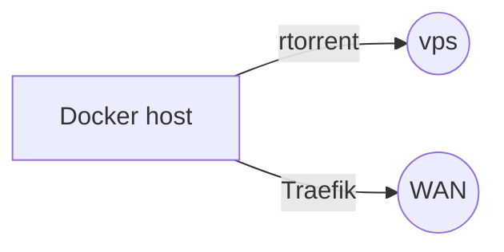

# Under Construction :gift:
# :sunrise:**The-ultimate-seed-box**:sunrise:
 Rutorrent+rtorrent+traefik+filebot+plex+synology **ON DOCKER** 

FOR EDUCATIONAL PURPOSE ONLY

**NOOB PROOF**

🎉Objectif🎉
- [x] Wireguard as back gateway
- [x] Rutorrent & rtorrent 
- [x] Plex
- [x] Traefik
- [x] Filebot licence :dollar:

>⚠️ $`\textcolor{ORANGE}{\left[ \text{IMPORTANT}\right]}`$\
> YOU NEED :
>- A [**NAS**](https://www.synology.com/) with nfs or cephfs (NFS IS USE IN THIS EXAMPLE)   
>- [**OWN A DOMAIN**](https://www.ovhcloud.com/fr/domains/?at_medium=sl&at_platform=google&at_campaign=AdWords&at_creation=noi_ovh_fr_se_web_domain_defensive_generic()&at_variant=660811248197&at_network=search&at_term=ovh%20r%C3%A9servation%20nom%20de%20domaine&gad_source=1&gclid=Cj0KCQjw3ZayBhDRARIsAPWzx8rhwgKhyALQVHHm07s7LTv88J3SVSYXBHzpntuxWSPjzO0aR1VPdUcaApGeEALw_wcB) (DUMY.COM IN THIS EXAMPLE)
>- Get a [**VPS**](https://www.ovhcloud.com/fr/vps/) to host the wireguard server and act as the rtorrent gateway
>- [**FILEBOT licence**](https://www.filebot.net/purchase.html)  
>- MAXMIND [**GEOIP**](https://support.maxmind.com/hc/en-us/articles/4407099783707-Create-an-Account) account
>- [**PLEX**](https://support.plex.tv/articles/201862428-plex-accounts/) account
>- [**DEBIAN**](https://www.debian.org/index.fr.html) host with [docker installed](https://docs.docker.com/engine/install/debian/)

1. **[HOW IT'S WORK](#how)**
2. **[WIREGUARD](#wireguard)**
- **[server conf](#wgsrv.conf)**
- **[client conf](#wgclt.conf)**
3. **[TRAEFIK](#TRAEFIK)**
4. **[RUTORRENT-RTORRENT](#rtorrent)**
- **[geoip](#geoip)**
- **[storage](#storage)**
5. **[PLEX](#plex)**
6. **[FILEBOT](#filebot)**

## 1.***HOW IT'S WORK ***
- [Rutorrent](https://www.rapidseedbox.com/fr/kb/beginners-guide-to-rutorrent) for the webgui [Rtorrent](https://fr.wikipedia.org/wiki/RTorrent) management  
-  [Filebot](https://www.filebot.net/) to rename correctly the file optain with rtorent and ad it to the plex server
-  [Wireguard](https://www.wireguard.com/) to handle rtorrent trafik threw a vpn to a vps and expose is ip
- [Traefik](https://github.com/traefik/traefik) as reverse proxy and to obtain [let's encrypt](https://letsencrypt.org/docs/challenge-types/) certificats by http-01 challenge for [https](https://fr.wikipedia.org/wiki/Hypertext_Transfer_Protocol_Secure) purpose 
- [Plex](https://www.plex.tv) to enjoy the rtorent content

## 2.***WIREGUARD ***
>ℹ️ $`\textcolor{BLUE}{\left[ \text{NOTE}\right]}`$\
>If you are lazy, use [this (awesome)](https://upvpn.app/wireguard-config-generator/) site to create your configuration files
### **server conf **

### **client conf **

## 3.***TRAEFIK ***

## 4.***RUTORRENT-RTORRENT ***

### **geoip**

### **storage **

## 5.***PLEX ***

## 6.***FILEBOT ***

